# RCAC Onboarding Guide

## Checking and Granting Access

You can request, manage, and view access and permissions within your RCAC account at [https://www.rcac.purdue.edu/account](https://www.rcac.purdue.edu/account). The "Groups" tab on the left will list all groups you are either a manager or member of. 

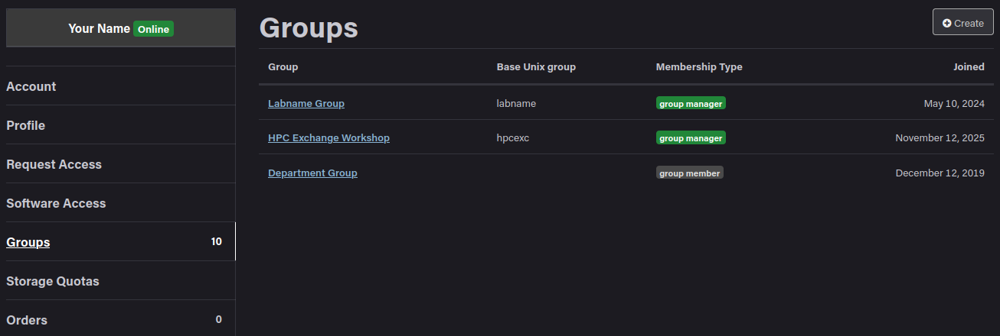


Clicking a particular group will allow you to view the members, resources, and storage that that group has. Group managers are also able to add and remove group members here as well.

--- 

## Cluster Layout

Before we begin, we must understand what a cluster actually is, and what it consists of. A cluster is built from many inter-connected servers, which are attached to one or more **data** storage systems. They typically run a **UNIX**-like operating system and are managed by a **scheduler**, which we will talk about in a bit.


### Nodes

So what are these servers that make up the clusters? They're all just computers! They look a certain way and live in a data center, but at the end of they day its just a specialized computer with memory, CPUs, and storage. When referring to a server as part of a group, such as in a cluster, we typically refer to them as **nodes**, although they go by many other names such as: computer, server, machine, host.

Different nodes can also have different purposes, such as **login** vs. **compute** vs. **data**. We will get into this distinction more later in this section.

Here is what a node looks like and what it is
made up of:

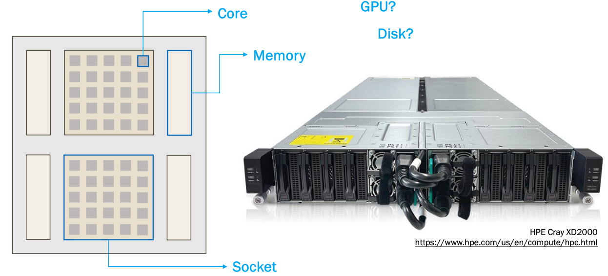

Each node has one or more sockets that are each made up of a number of cores. Each socket has its own memory associated with it. There are many other components that can make up a node, such as disk space, or GPUs.


### Cluster

Very broadly, a cluster is just a collection on nodes, which are able to communicate and work together. Most clusters are broken up into two main parts:

1) Front-end or login nodes

2) Compute or back-end nodes

When you log into the cluster, you are put onto a login node, which is limited in resources and not suitable for doing actual research. You need to interact with the scheduler to move from the login nodes to the compute nodes.

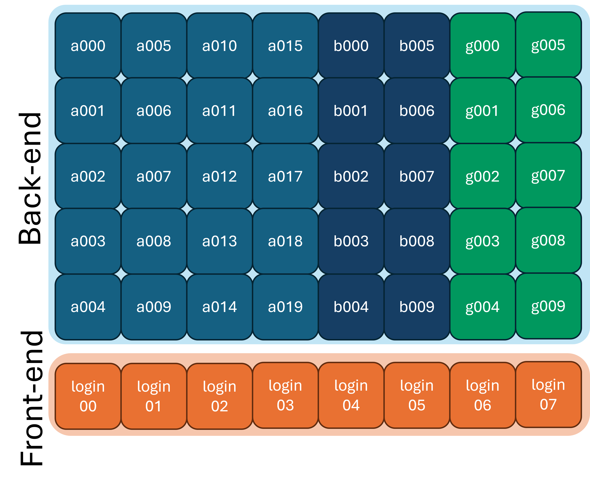

You can typically tell what node (and node type) you are on by looking at your command prompt:
```
user@login00 ~ $ 
```

or by using the `hostname` command:
```bash
$ hostname
login00.cluster.rcac.purdue.edu
```

---

## Logging in

There are three main ways to get onto the cluster(s):


=== "SSH"

    
    `ssh` is the simplest way to access the cluster. Most UNIX systems (such as Linux and macOS) have the `ssh` program already installed. Windows 11 comes with the `ssh` program already there as well. To use `ssh`, open a Terminal (in any system). And use the command:

    ```sh
    $ ssh USERNAME@CLUSTER.rcac.purdue.edu
    ```
    Where `USERNAME` is replaced with your Purdue username
    and `CLUSTER` is replaced with the cluster you are
    trying to access.

    You should see something that looks like this:

    ```
    ************************************************************

    ***** Use of Purdue BoilerKey or SSH keys is Required ******

    ************************************************************

    (USERNAME@CLUSTER.rcac.purdue.edu) Password:
    ```
    Here you should enter in 'password,push'. It will not look like anything is being typed. But the characters are being entered.

    * This is a security feature of `ssh` so that people don't know
    how long your password is.

    Once you enter your password and hit the enter key, it will
    prompt a Duo push on your phone. Once you approve the Duo
    push, you will be logged in (if you have been granted access
    to the cluster you are trying to get into).

    When you're logged in, you prompt should change to be of
    the form of:

    ```
    USERNAME@loginXX.CLUSTER:[~] $
    ```

    You're now ready to do things on the cluster!

=== "ThinLinc"

    ThinLinc is an alternative we provide if you would like a more familiar GUI-based interface. There are two ways to use ThinLinc: the browser version and the desktop version. The desktop version requires a download, but it has a couple more features that the browser version doesn't have. Specifically, you can use ssh keys as well as restart your session in the desktop version, which you can't do in the browser version.

    You can download the desktop ThinLinc client from Cendio here: [Cendio](https://www.cendio.com/thinlinc/download/)

    Otherwise, if you want to use the browser version, simply open up your favorite internet browser and navigate to `desktop.CLUSTER.rcac.purdue.edu`, where `CLUSTER` is replaced with the name of the cluster you want to access.

    The desktop version of ThinLinc looks like this:
    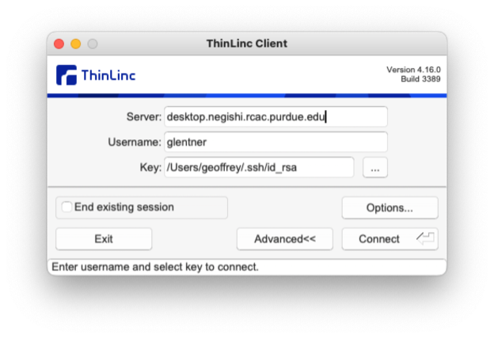


    You may need to click the `Advanced` button to see
    everything you need to.

    The Server here is `desktop.CLUSTER.rcac.purdue.edu`, where
    `CLUSTER` is replaced with the name of the cluster
    you want to access. The username is your Purdue username
    and password is your Purdue password appended with ',push'.
    That is, it would be 'password,push'. For the desktop version,
    you will see one or two windows pop up that you just need to
    click through and then it will prompt two Duo pushes, that
    you need to approve. After you're logged in, you'll see
    something that looks like this:
    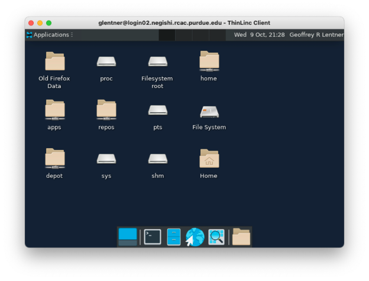

    Use ThinLinc, either the browser or desktop version, if
    you want to run any kind of graphical application, like
    Matlab for example.

    ThinLinc is also nice that the sessions are persistent,
    it will hold onto your applications and running shells
    unless you don't log in for 2 weeks.

=== "Open OnDemand"

    Open OnDemand, also known as the Gateway, is a modern web
    interface to our HPC resources. You don't need to open a
    terminal, or understand a UNIX command-line shell. Although,
    you can open a shell from it. You can check/edit files and
    organize your data through the web interface. You can even
    request interactive compute sessions with apps such as
    Jupyter, RStudio, Matlab, etc.

    To log in to Open on Demand, open your internet browser and
    navigate to `gateway.CLUSTER.rcac.purdue.edu`, where `CLUSTER`
    is again replaced with the name of the cluster you are
    trying to access. After you log in through Purdue's normal
    Single Sign On page (no need to add ',push' to your password),
    you should see something like this:

    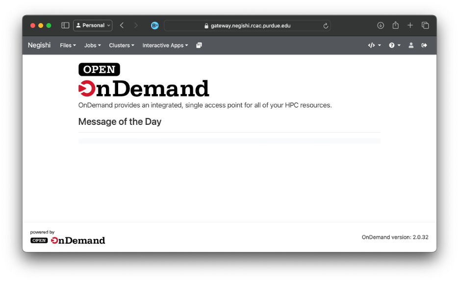

    To open a shell to enter the Unix commands we will discuss
    this week, click the 'Clusters' menu in the top bar and hit the
    `>_CLUSTER shell access` option. This will open a new tab with a
    shell available for you to use.

---

!!! tip "Accessing on the web"
     Thinlinc and open OnDemand are both available on the "cluster overview" page for any cluster, like [https://www.rcac.purdue.edu/compute/negishi](https://www.rcac.purdue.edu/compute/negishi) for example:

     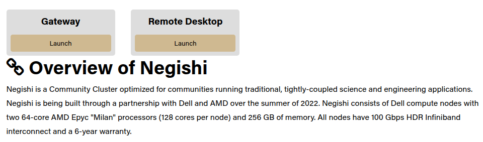

Reminder that when you log into the front-end (a login node). Don't run large computations here!

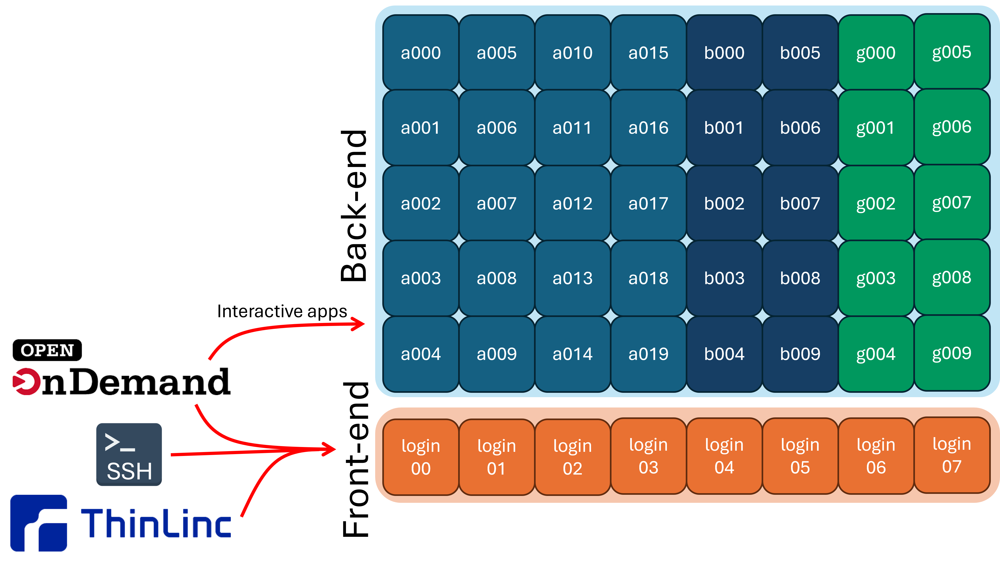

---

## Filesystems

It is important to understand that many filesystems on the cluster are **shared across nodes**. 

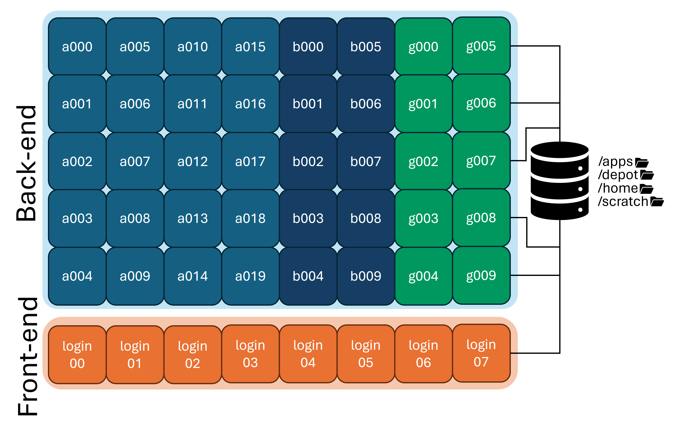

If you create a file in your home directory on a login node, that same file will be available on any of the compute nodes, because all of the nodes are mounting the same home directory filesystem.


Let's take a closer look at some of these filesystems:

=== "Home"
    * Path: `/home/username`

    Your home directory is small (only 25GB), it has mild performance and is cluster specific (it is shared between nodes of a cluster, but not across clusters). It is also mountable on your local computer as a network drive.

    Home directories are housed on redundant hardware, are **never purged** and are protected by snapshots. They are private to each user (they cannot be accessed by other members of your research group)

    Home directories are good for personal configuration files, software installation, scripts, etc. You can also store personal data and job files, if they're small enough. It's ok to run jobs against your home directory, but it's not good for heavy I/O scenarios. In short, it's good for medium to long term storage.

=== "Scratch"
    * Path: `/scratch/<cluster>/username`

    Your scratch directory is a high-performance directory on each cluster. It is huge (100+TB), however it does have a file number limit (in the millions), so make sure to not have a bunch of tiny files.

    The scratch system is internally redundant, so you don't have to worry about hardware failure corrupting your data, but there are no snapshots, so files are not recoverable if deleted. **It is also regularly purged of older files.**

    Scratch directories are good for intermediate to massive data I/O, so are perfect for data intensive jobs. It is **NOT** for the primary copy of your data or software. And it is **NOT for long-term storage.** It is only for short-term storage of intermediate results.

    !!! warning Scratch Purge Cycles
        Scratch directories are **regularly purged of old data**. If a file is not accessed within 60 days (30 days on Bell), it will be staged for purging. RCAC sends courtesy Email warnings to users when files are staged for purging, but you should not rely on these Emails. Please be proactive in backing up any valuable data or results you have stored in scratch. 

        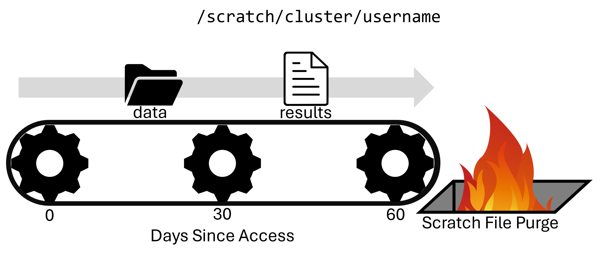

        You can use the `purgelist` command to tell you which files in your `/scratch` directory are staged to be purged.

=== "Depot"
    * Path: `/depot/<group_name>`

    The Data Depot is a group directory mounted on all Purdue community clusters. It is larger than your home directory (100GB free trial) and PI's can purchase additional space at $47/TB/year. It has reasonable performance with redundant hardware that is **never purged** and is protected by snapshots.

    It is **mounted on all clusters**, so you see the same data no matter which cluster you're using. You can also mount it as a network drive on your local computer.

    It is **owned by the PI** of the group and is **shared by group members**. It also offers fine-grained access controls.

    Importantly, you can use the data depot without any cluster purchase, if you need somewhere persistent to store your data.

    The Data Depot is good for shared configuration files, software installation, scripts, etc. You can store critical research data here to be shared amongst your group. It's ok to run jobs against but it's **not good for intensive I/O scenarios**. It is good for medium to long term storage.

=== "Temp"
    * Path: `/tmp`

    There is a node-local `/tmp` directory on Purdue's community clusters. It is moderately large (200+GB) with good performance. However, there is zero redundancy and files are purged after your job on the node ends. There are no snapshots of data in the `/tmp` directory.

    It is node-local, i.e. each node of the cluster has its own `/tmp` that is world-readable (and sort of writable). It is what researchers used to use before the Scratch directory.

    It is good for node-local caching of data and files. It is **NOT** for valuable data or software and **NOT** for long-term storage. It is rarely needed, but priceless when you do need it. Unless you understand the tradeoffs, consider just using your Scratch directory.

=== "Apps"
    * Path: `/apps`

    Apps is managed by RCAC staff, and is where all centrally installed applications are located. You may often use the applications that are located here, but users are not able to modify centrally installed applications. 

    All of the applications available in the `Lmod` module system (see below) are installed here!
---

You can check the current usage of your `home`, `depot`, and `scratch` spaces with the `myquota` command:

```bash
$ myquota
Type       Location             Size    Limit    Use   Files   Limit    Use
===========================================================================
home       username           18.0GB   25.0GB  72.0%      -       -      - 
scratch    username          670.8MB  200.0TB   0.0%  170.4K    2.0M   8.5%
depot      labname             4.0MB  100.0GB   0.0%      -       -      - 
```

Summary of filesystem locations:

|Storage | Location | Purpose | Availability| Capacity | Backed up?|
|--------|----------|-------|------------| ----| --- | 
| Home   | `/home/username`| Backed up personal storage | Shared across all nodes| 25 GB | Yes
| Scratch | `/scratch/cluster/username`| Large temporary files -  **Purged Regularly** | Shared across all nodes| 200 TB, 2M Files | No
| Depot | `/depot/<groupname>`| Files and programs for your lab | Shared across all nodes **AND** across clusters| 100+ GB | Yes
| Temp | `/tmp`| Temporary files | Node specific| 200+ GB | No
| Apps | `/apps` | Centrally Installed Applications |  Shared across all nodes |  | 

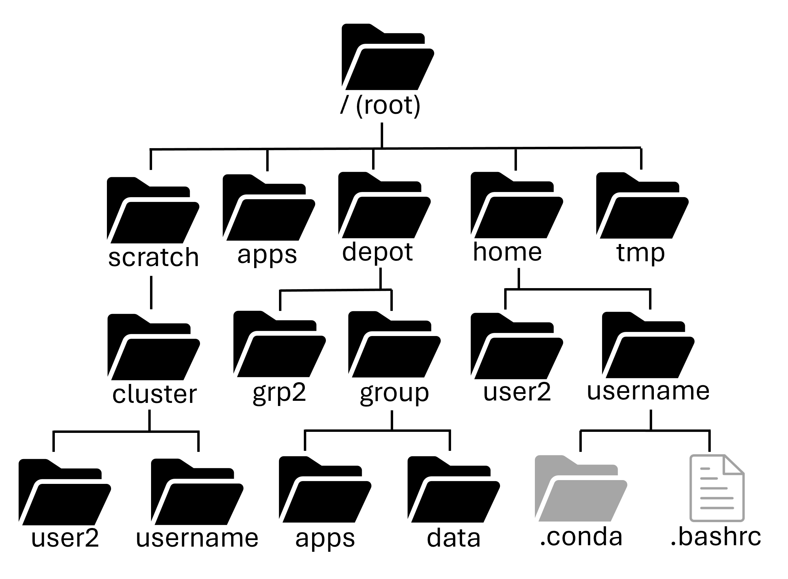


## Transferring Data

### GUI Methods

=== "Open OnDemand"

    In the files tab of the Open on Demand page, there are
    upload and download buttons, but they are limited in
    what they can do. e.g. there is a file size limit of
    100 GB to upload and if your connection is flaky at
    all, you're going to have a bad time.

    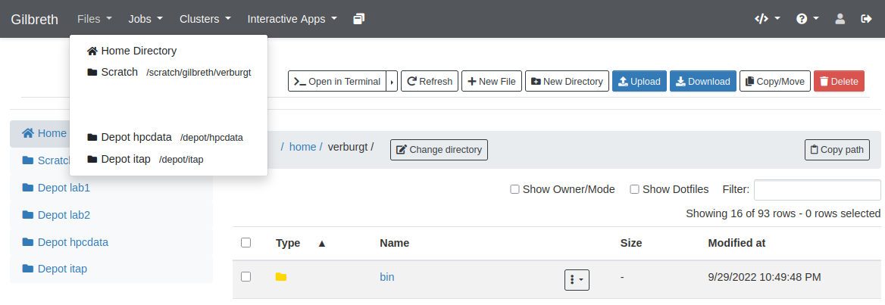

=== "Globus"

    For transferring large data to the cluster, you will
    want to use the [Globus transfer service](https://transfer.rcac.purdue.edu). If you want to transfer files from your local machine
    to the cluster, you will need to install the [Globus Connect
    Personal](https://www.globus.org/globus-connect-personal) software on your local computer.

    From the Globus transfer service, you can select a source
    and a destination. It will handle the actual transferring
    of the file(s) for you, resuming if there's network
    connectivity problems.

    

---

### Command Based Methods

=== "scp"

    `scp` stands for `secure copy protocol` and is the server version of the `cp` we saw last week. It needs a source and a destination, but one of them may be a server.

    Copying to a cluster:
    ```bash
    $ scp ./source_file USERNAME@CLUSTER.rcac.purdue.edu:~/some_dir/cluster_file_name
    ```
    Copying from a cluster:
    ```bash 
    $ scp USERNAME@CLUSTER.rcac.purdue.edu:~/some_dir/cluster_file_name ./destination_file
    ```
    When copying from a cluster, the destination file will go into the directory you are currently in. You can also specify a path you want the destination file to go to. This path can be either relative, or absolute.

=== "rsync"

    `rsync` is similar to `scp`, but much more fully-featured. It is especially useful for transferring directories, syncing changed files, and resuming interrupted transfers.

    Copying a file to a cluster:
    ```bash
    $ rsync ./source_file USERNAME@CLUSTER.rcac.purdue.edu:~/some_dir/cluster_file_name
    ```

    Copying a file from a cluster:
    ```bash
    $ rsync USERNAME@CLUSTER.rcac.purdue.edu:~/some_dir/cluster_file_name ./destination_file
    ```

    Copying a directory to a cluster:
    ```bash
    $ rsync -av ./my_directory/ USERNAME@CLUSTER.rcac.purdue.edu:~/some_dir/
    ```

    Copying a directory from a cluster:
    ```bash
    $ rsync -av USERNAME@CLUSTER.rcac.purdue.edu:~/some_dir/my_directory/ ./my_directory/
    ```

    A few common options are:

    - `-a` for **archive mode**, which preserves file structure, permissions, and timestamps
    - `-v` for **verbose**, which shows what is being transferred
    - `-h` for **human-readable** file sizes
    - `--progress` to show transfer progress
    - `--partial` to keep partially transferred files if a transfer is interrupted

=== "sftp"

    `sftp` stands for `secure file transfer protocol` is a
    reliable way to transfer files between the cluster and
    another computer.

    Essentially, `sftp` starts a file transfer shell on a
    remote computer. Simple use the command `sftp USERNAME@CLUSTER.rcac.purdue.edu`
    to start the file transfer session. After logging in,
    use the `get` and `put` programs to transfer to and from
    the cluster you are connected to:

    ```bash
    $ sftp USERNAME@CLUSTER.rcac.purdue.edu

        (transfer TO CLUSTER)
    sftp> put sourcefile somedir/destinationfile
    sftp> put -P sourcefile somedir/

        (transfer FROM CLUSTER)
    sftp> get sourcefile somedir/destinationfile
    sftp> get -P sourcefile somedir/

    sftp> exit
    ```
    When transferring to and from the cluster via `sftp`, the transferring on the side of your local computer will be relative to the directory you were in when you initiated the `sftp` session.

---

## Applications

RCAC offers a wide array of pre-installed applications and libraries across many different disciplines. Most of these applications are accessible through the module system:

### Module System

There are too many versions and conflicting software to have every version of every application pre-installed for all users all the time. To get around this problem, we use a module system called `Lmod`. This module system can load and unload programs and commands within your shell environment.

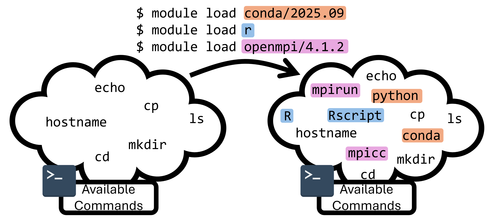

As an example, run the command `module list` to list all currently loaded modules:

```
$ module list

Currently Loaded Modules:
1) gmp/6.2.1 3) mpc/1.1.0 5) gcc/12.2.0 7) openmpi/4.1.4 9) rcac -> modtree/cpu
2) mpfr/4.0.2 4) zlib/1.2.13 6) numactl/2.0.14 8) xalt/3.0.2 (S)

Where:
S: Module is Sticky, requires --force to unload or purge
```
There are many different `module` commands that we can use to learn about what's available on the system and what our current environment is:

| Command | Description |
|--------|-------------|
| `module list`   | List currently loaded modules |
| `module load`   | Load a module by name (and version) |
| `module unload` | Unload an already loaded module |
| `module avail`  | Search for currently available modules |
| `module spider` | Recursively search the entire module tree |
| `module purge`  | Unload all currently loaded modules |
| `module reset`  | Revert to the default module set |
| `module show`   | Show the module definition |
| `module help`   | Show help message for a module |

---

## Slurm Submission

In order for your jobs to run on the back-end, you must interact with the scheduler to request a specific amount of back-end resources.

A scheduler is software that manages how computing resources are shared among users. At RCAC, we use **Slurm**, the most widely used scheduler at major computing centers.

Because there are a limited number of compute nodes and many users submitting jobs, the scheduler is responsible for deciding when and where each job runs. It tracks resource requests (such as CPUs, GPUs, memory, and time limits), queues, jobs, and launches them when the requested resources become available.


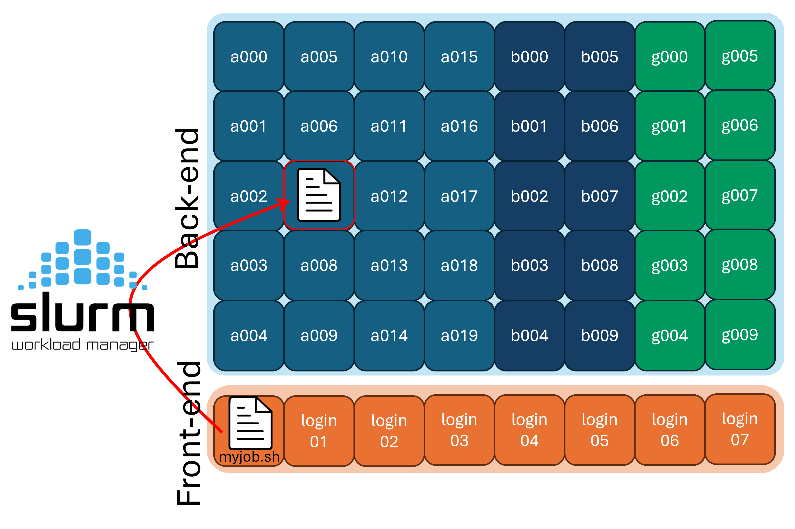


Before we get started with how to run jobs on the compute nodes, we should talk about the two paradigms of running code on a supercomputer:

* Batch mode

* Interactively

In the `batch` paradigm, you write your code, and then submit one (or many) instances of your code using the scheduler and it can run on arbitrarily many nodes without worry of interruption.

In the `interactive` paradigm, you get a session on a compute node (using the gateway, ssh, or ThinLinc), and the run your code directly. However, if your network drops, your code could be interrupted.

### Batch Submission

Users submit their work to Slurm in the form of batch job scripts, which are shell scripts that describe the resources needed and the commands to run. This shell script can be submitted to the scheduler via the `sbatch` program. The details of what resources are requested are called "directives" and are commonly inside the script itself, but can also be passed to the `sbatch` program manually. Let's take a look at an example job script, `myjob.sh`:

```bash title="myjob.sh" linenums="1"
#!/bin/bash
#SBATCH  --account=hpcexc
#SBATCH  --partition=cpu
#SBATCH  --qos=normal
#SBATCH  --time=0-1:00:00
#SBATCH  --nodes=1
#SBATCH  --ntasks-per-node=1

cd $SLURM_SUBMIT_DIR

module load conda
conda activate example_env
python example.py
echo "Script is finished! Exiting..."
```

Once you are ready, submit it to the scheduler with the `sbatch` program:

```bash
$ ls
example.py  myjob.sh  ...

$ sbatch myjob.sh
Submitted batch job 32209880
```
`sbatch` will read the directives that we put in the script, and schedule your job script to be ran. The job ID number is helpful to note down as it can be used elsewhere.

Let's take a look at the individual pieces of information we gave slurm about our job:

=== "Account"
    ```bash linenums="1" hl_lines="2"
    #!/bin/bash
    #SBATCH  --account=hpcexc
    #SBATCH  --partition=cpu
    #SBATCH  --qos=normal
    #SBATCH  --time=0-1:00:00
    #SBATCH  --nodes=1
    #SBATCH  --ntasks-per-node=1
    ```
    The first of which is what account to submit
    that job to. Accounts are typically associated with a research group or department. Each account will have access to a limited amount of resources that they have purchased.

    Use the `slist` program to show which Slurm accounts are available for you to submit to, and what their current usage is. 

    ```
    $ slist
                            Current Negishi Accounts                                
    ==============================================================================    
                |              CPU Partition              |     Standby QOS        
    Accounts       |   Total     Queue      Run      Free    |   Queue      Run       
    ============== | ========= ========= ========= ========= | ========= =========    
    hpcexc         |        64         0        10        54 |         0         0

    ```

    In the above example, the group has bought 64 cores of priority access. However, someone from this group is using 10 cores, sop this group has 54 cores of priority access left.

=== "Partition"
    ```bash linenums="1" hl_lines="3"
    #!/bin/bash
    #SBATCH  --account=hpcexc
    #SBATCH  --partition=cpu
    #SBATCH  --qos=normal
    #SBATCH  --time=0-1:00:00
    #SBATCH  --nodes=1
    #SBATCH  --ntasks-per-node=1
    ```

    Remember that not all backend/compute nodes are the same! Some nodes have special hardware like GPUs or increased RAM, or are set aside for a dedicated use like machine learning training. To manage this, we use partitions, which are just subsets of the compute nodes. We need to tell Slurm which partition we intend on using.

    To show the different partitions
    available on the cluster, run the `showpartitions`
    program:

    ```
    $ showpartitions
    Partition statistics for cluster negishi at Thu Jul 17 16:12:58 EDT 2025
    Partition       #Nodes     #CPU_cores  Cores_pending   Job_Nodes MaxJobTime Cores Mem/Node
    Name  State   Total  Idle  Total   Idle Resorc  Other   Min   Max  Day-hr:mn /node     (GB)
    cpu      up     446     0  57088   2078      0  15973     1 infin   infinite   128     257
    highmem  up       6     0    768    236      0   2114     1 infin   infinite   128    1031
    gpu      up       5     3    160    132      0      0     1 infin   infinite    32     515
    ```

    !!! note
        On many clusters, certain accounts will only be able to submit to specific partitions.
     

=== "QoS"
    ```bash linenums="1" hl_lines="4"
    #!/bin/bash
    #SBATCH  --account=hpcexc
    #SBATCH  --partition=cpu
    #SBATCH  --qos=normal
    #SBATCH  --time=0-1:00:00
    #SBATCH  --nodes=1
    #SBATCH  --ntasks-per-node=1
    ```
    The *Quality of Service* (QoS) for the job determines the priority and some constraints of your job. The two primary QoS values will be `normal` and `standby`:

    * The `normal` QoS gives your job increased priority, but subtracts from your accounts available resources. You can think of this as the "Fast-Pass" entrance at the amusement park that lets you skip the line.
        * `normal` jobs can run for up to 2 weeks.

    * The `standby` QoS doesn't subtract from your accounts resources, but are given very low priority to run.
        * `standby` jobs are only allowed to run up to 4 hours

    

=== "Resources"
    ```bash linenums="1" hl_lines="5-7"
    #!/bin/bash
    #SBATCH  --account=hpcexc
    #SBATCH  --partition=cpu
    #SBATCH  --qos=normal
    #SBATCH  --time=0-1:00:00
    #SBATCH  --nodes=1
    #SBATCH  --ntasks-per-node=1
    ```

    We may also need to specify what resources we want to request, and for how long

    * `--time` is the maximum time your job will run. If your job has not yet finished in this amount of run time, it will be cancelled.

    * `--nodes` is the number of nodes you want to request. 

    * `--ntasks-per-node` is the number of CPUs

---

!!! note
    Required directives may vary by cluster and partition. For example, some clusters will require you to request memory with `--mem`, or to list how many GPUs you want access to with `--gres=gpu:`. See the user guide for the cluster you are using for more details, and the [sbatch documentation](https://slurm.schedmd.com/sbatch.html) for a complete list of options. 

    | Long Form |  Short Form | Description |
    |-----------|-------------|-------------|
    | --account | -A          | Which account to submit under |
    | --partition | -p  | Which partition to submit to|
    | --qos   | -q | quality of service for job| 
    | --nodes | -N | Number of nodes requested | 
    | --ntasks | -n | Number of tasks requested |
    | --ntasks-per-node | | Number of tasks requested per node |
    | --cpus-per-task | -c | CPUs to be allocated for each task  |
    | --cpus-per-gpu |  | Number of CPUs allocated per GPU |
    | --mem | | Amount of Memory to request|
    | --mem-per-cpu | | Memory requested per allocated CPU|
    | --time | -t | Length of time to run job for |
    | --gres=gpu:<count> | | Number of gpus requested
    | --gpus-per-node| | Number of gpus requested for each node

### Interactive Jobs

To get an interactive job (or essentially a shell on a compute node), use the `sinteractive` program (which is RCAC specific). You will need to specify the same parameters as with `sbatch` (e.g. account, partition, QoS, cores, nodes, time).


``` hl_lines="1 8"
username@login03.negishi:[~] $ sinteractive -A hpcexc -p cpu -q normal -n 1 -t 00:10:00
salloc: Pending job allocation 19809515
salloc: job 19809515 queued and waiting for resources
salloc: job 19809515 has been allocated resources
salloc: Granted job allocation 19809515
salloc: Waiting for resource configuration
salloc: Nodes a195 are ready for job
username@a195.negishi:[~] $
```


Notice that before the `sinteractive` program was run, we were on `login03.negishi` and after it was run, we are now on `a195.negishi`, this is a good way to tell if you are running on a compute node, or on a login node.

To get out of the interactive slurm job, simply run the `exit` command and you'll be returned to the login node you were on previously.


### Open OnDemand Interactive Apps
If you'd rather avoid running jobs on the command line entirely, RCAC offers Open OnDemand interactive apps that handle the submission to the compute backend for you. 


Most notably, we have an "Open OnDemand Desktop" application, which will give you a virtual desktop (running on a cluster backend node) available in your browser. This can be incredibly useful if you need to run GUI applications on RCAC clusters, which don't run well over SSH on the command line.

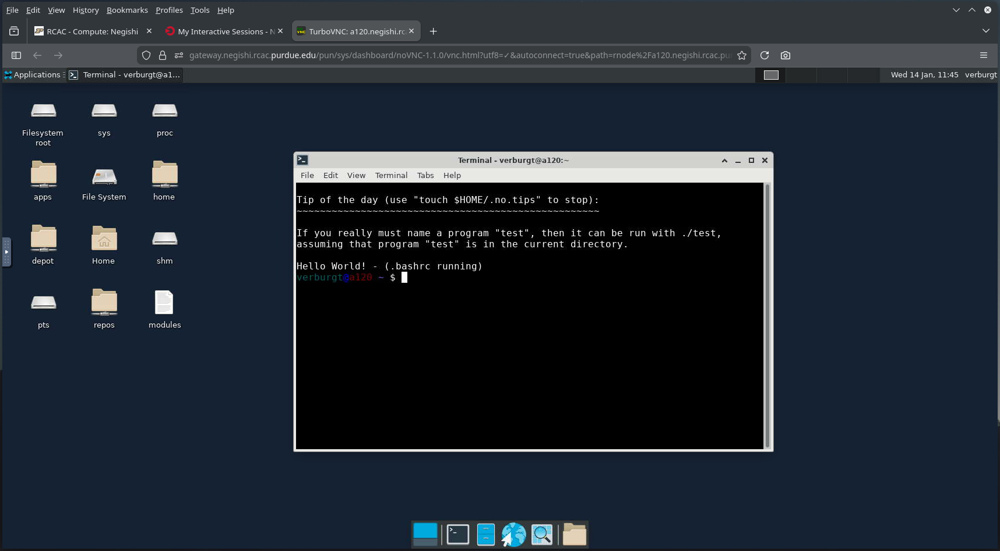


## Job Monitoring and Management

You can use the `squeue` program to list currently scheduled
(pending and running) jobs. By default it will show all jobs
from all users on the cluster, which leads to a lot of
output. You can limit this to just your jobs with the `--me` flag:

```bash
$ squeue --me
JOBID      USER     ACCOUNT      PART QOS     NAME       NODES TRES_PER_NODE   CPUS  TIME_LIMIT ST TIME
32541229   username hpcexc       cpu  normal  interactiv     1 N/A                8       30:00  R 0:09

```
This can give you importiant information such as the status of your job (`R` for running, `PD` for pending, and `CG` for cancelling), as well as the current run time. 

To learn more about the parameters of a single job, you can use the `jobinfo` program. To use `jobinfo`, the command would be `jobinfo JOB_ID`, where the `JOB_ID` is replaced with the job ID mentioned above (which you can also check with the `squeue` program).

```bash
$ jobinfo 32209880
Name : myjob.sh
User : username
Account : hpcexc
Partition : cpu
Nodes : a305
```
There are also `jobenv`, `jobcmd`, and `jobscript` programs that tell you more information about the job as it was submitted.

To cancel a job, use the `scancel` command. It used by running `scancel JOB_ID`, where `JOB_ID` is replaced with the job ID mentioned before.

```bash
$ scancel 32209880
```